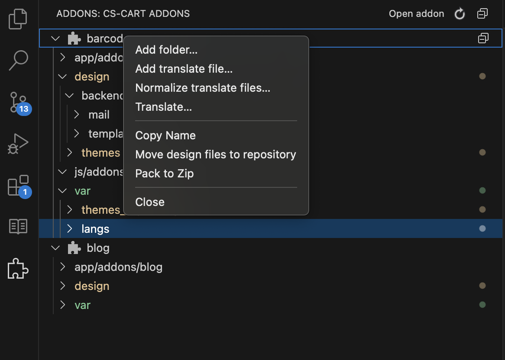
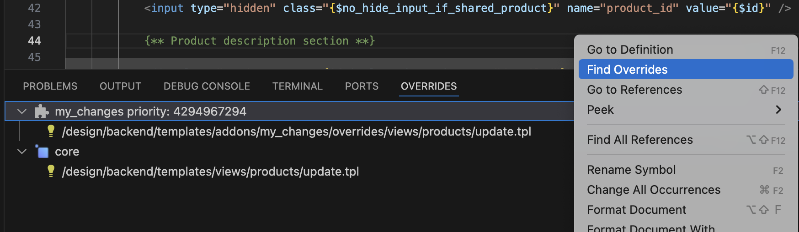

# CSCart development helper for Visual Studio Code

Working with addons in a separate section, automatic search and translation of language variables, search for smarty template overrides and more.

## Features

This extension adds a new container for working with addons. It allows:

- Work with files of the selected addons separately from the project.
- Normalization of translation files and search for a lost langvars (for addon with scheme version 3.0 and 4.0).
- Automatic translation of langvar into selected languages (for addon with scheme version 3.0 and 4.0).
- Pack addon to Zip

Following example shows addon explorer:

Extension allows to find all overrides and original files of the CS-Cart Smarty Templates in all themes and sort them by priority

## Requirements

Latest version of Visual Studio Code

## Release Notes

### 0.0.6

Command for fast create addon folders and translate files

### 0.0.5

Automoving design files to repository
Pack addon to Zip
Some fixes

### 0.0.4

Fixes for smoothness while files update
Highlighting selected file in addon explorer
Some fixes

### 0.0.3

Fixes for normalizing
Collapse addon

### 0.0.2

Fixes for translating script

### 0.0.1

First beta-release
Addon Explorer, normalize, translate addon lang vars and find template overrides

**Enjoy!**
